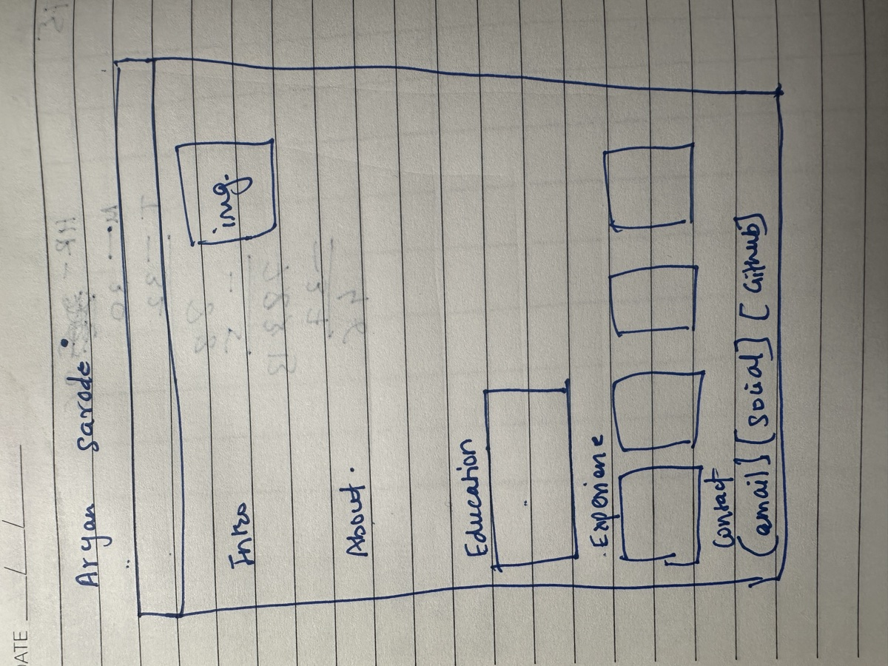
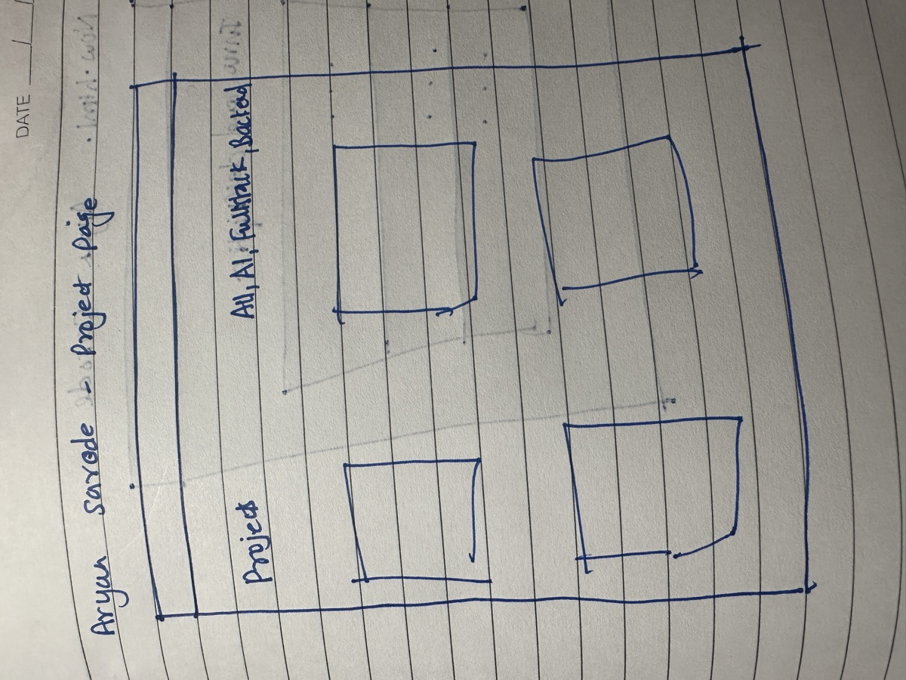
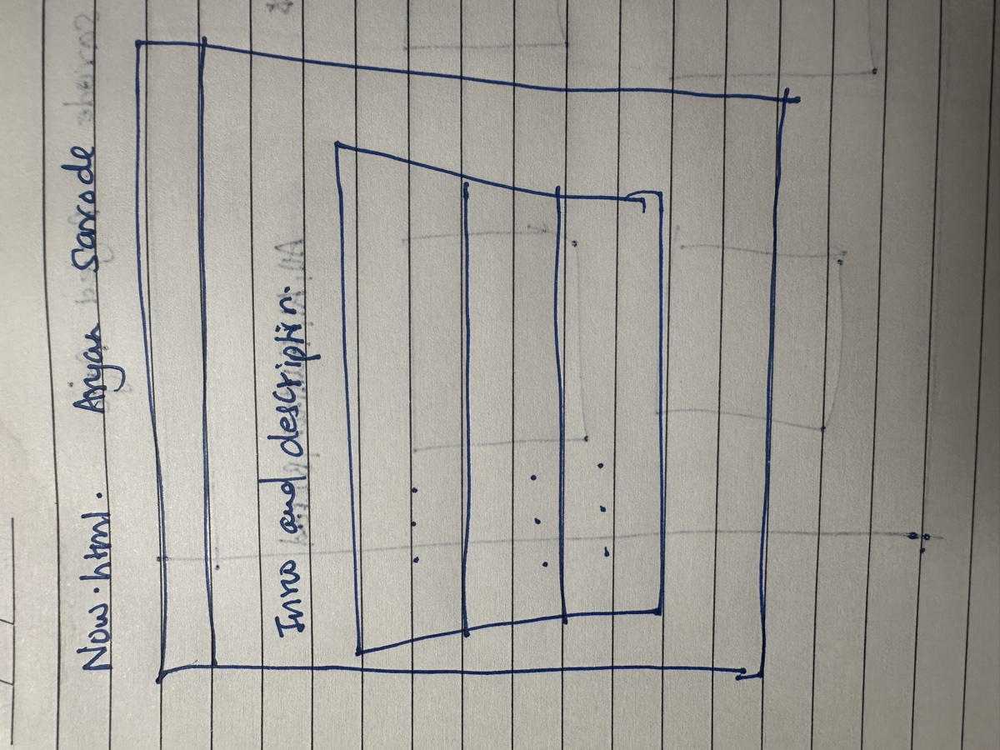

# Design Document

## The project

This is my personal homepage. I'm Aryan Sarode, an MS Computer Science student at Northeastern University in Boston, and I built this site to give recruiters, engineers, and classmates a quick, honest picture of who I am, what I've built, and how to reach me.

The site runs entirely in the browser. It uses plain HTML, CSS, and vanilla JavaScript with ES6 modules, with the Bootstrap 5 grid for responsive layout. There is no backend and no framework.

There are three pages:

- **Home** introduces me, with a short about section, my education, my work experience, a "Currently learning" tracker, and my contact links.
- **Projects** shows four projects I've built as cards, with a filter so visitors can narrow them down by category.
- **Now** describes what I'm focused on at the moment. This page was generated entirely with AI, as the assignment requires.

### What makes it mine

Two small features make the site more than a static resume:

1. **The "Currently learning" tracker.** I'm working through a 57 session DSA course in Java, and the home page shows my progress with a progress bar. Buttons let me move it forward or back one session. It shows that I'm actively building skills, not just listing them.
2. **The project filter.** My projects span AI, full stack, backend, and Java work. Instead of making an engineer read all of them, the filter buttons show only the category they care about.

### Visual approach

I kept the design deliberately simple. A plain header with my name and navigation, content grouped into clearly labeled sections, and information presented in cards so each item stands on its own. The goal is that someone skimming for thirty seconds still finds what they need. There are no animations or decorative elements that slow down reading, and the layout stacks into a single column on a phone.

## Who it's for

### Priya, 29, university recruiter

Priya recruits students for software engineering internships at a fintech company in Boston. She reviews dozens of profiles a day, usually on her laptop between calls, and sometimes on her phone at career fairs. She gives each profile about thirty seconds. She wants to confirm three things fast: where I study, what I've actually worked on, and how to contact me. She gets frustrated by portfolios that hide basic facts behind long intros or break on mobile.

### Daniel, 36, senior backend engineer

Daniel interviews candidates after they pass the recruiter screen. The night before an interview, he opens my site on his desktop with my GitHub in another tab. His team builds AI powered backend services, so he wants to see which of my projects are relevant, what technologies I used, and whether there's real code behind the descriptions. He's tired of skill lists with no evidence behind them.

### Meera, 24, Northeastern classmate

Meera is an MS CS student looking for teammates for a hackathon. She found my link in the class Slack and opens it on her phone. She wants to know what I'm good at and what I'm working on right now, so she can tell whether I'd be a good fit for a team that needs backend and AI skills.

## User stories

### Priya, screening quickly

- As a recruiter, I want to see my candidate's name, school, and degree at the top of the home page, so I can decide in a few seconds whether to keep reading.
- As a recruiter, I want work experience shown as short cards with role, company, and dates, so I don't have to read paragraphs to understand his background.
- As a recruiter, I want email, LinkedIn, and GitHub links clearly visible, so I can reach out or move on without hunting.
- As a recruiter at a career fair, I want the site to work on my phone, so I can check a candidate while standing at the booth.

### Daniel, checking depth

- As an engineer, I want to filter projects by category, so I can go straight to the AI and backend work that matters to my team.
- As an engineer, I want each project to list its tech stack, so I can see what he actually used.
- As an engineer, I want each project to link to GitHub, so I can read the source before the interview.
- As a keyboard user, I want every button and link to work with Tab and Enter, so I can browse without a mouse.

### Meera, looking for a teammate

- As a classmate, I want to see what Aryan is learning right now, so I can tell whether he's actively building skills.
- As a classmate, I want a page about his current focus, so I can see if his goals line up with our hackathon team.

### Everyone

- As a screen reader user, I want images to have descriptions and every control to be a real button or link, so I can use the site without seeing it.

## Wireframes

These are the hand drawn wireframes I made to plan the layout of each page.

### Home

A header bar with my name and navigation. The intro sits on the left with my photo on the right. Below that come About, Education, a row of Experience cards, and Contact buttons at the bottom.

### Projects

The page title on the left with the filter options beside it, then four project cards in a two by two grid.

### Now

A header bar, a short intro and description, then one large panel divided into three stacked sections for what I'm studying, learning, and looking for.

### Mobile layout

On screens narrower than 768 pixels, the navigation collapses into a toggle menu, and every multi column section (education, experience, and project cards) stacks into a single column.

## Changes during implementation

The wireframes were a starting point, and a few things changed as I built the site:

- **Added the "Currently learning" tracker to the home page.** I decided to add it after sketching, as the original component that shows my DSA progress. It sits between the intro and the about section.
- **Added a Java filter.** The sketch shows All, AI, Full Stack, and Backend. I added Java so my Java calendar project has its own category.
- **Three experience cards instead of four.** I sketched four slots but have three roles to show: VidyarthiMitra, Texas A&M University Texarkana, and Outlier.ai.
- **Two education cards instead of one.** I added my undergraduate degree next to Northeastern.
- **The AI disclosure note on the Now page** sits in its own box below the three sections, so the shared footer stays identical across all pages.