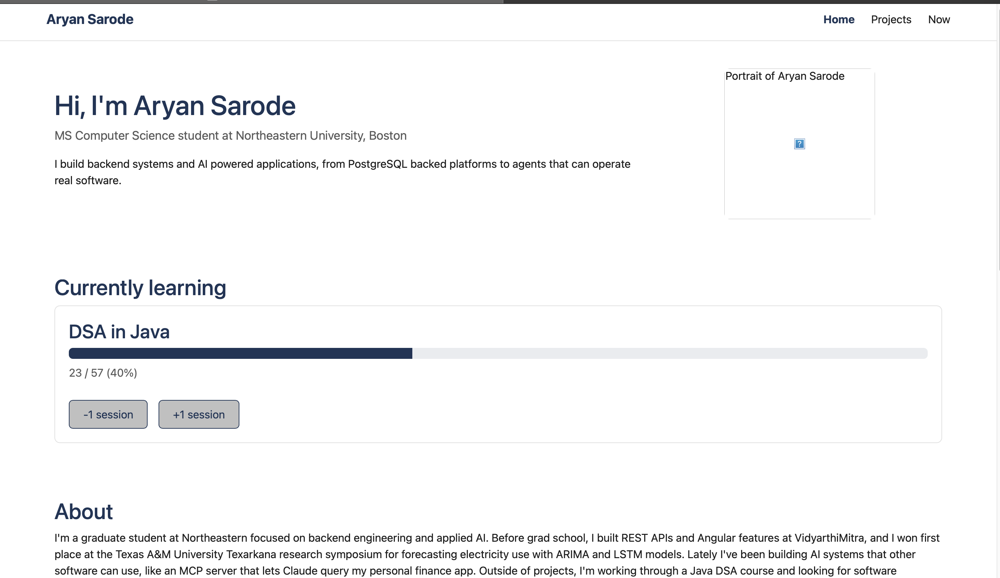

# Aryan Sarode — Personal Homepage

A three page personal homepage introducing Aryan Sarode's education, experience, and projects.

**Author:** Aryan Sarode

**Class:** CS5610 Web Development, [johnguerra.co/classes/webDevelopment_online_fall_2026](https://johnguerra.co/classes/webDevelopment_online_fall_2026/)

**Live site:** [aryansarode14.github.io/aryan-homepage](https://aryansarode14.github.io/aryan-homepage/)

**Video demo:** _(add video link here)_

## Project Objective

A simple, three page personal homepage for Aryan Sarode, an MS Computer Science student at Northeastern University in Boston. Its purpose is to give recruiters, engineers, and classmates a fast, clear picture of who Aryan is, what he has built, and how to reach him. The design goal is clarity over decoration: every page should answer its main question within a few seconds, work well on a phone, and be easy to navigate with a keyboard.

## Screenshot



## Pages

- **`index.html` (Home)** — introduction, a "Currently learning" progress tracker for a Java DSA course, an About section, education, experience, and contact links.
- **`projects.html` (Projects)** — four project cards (FinPulse, IT Service Management System, Personal Email RAG System, Multi Mode Calendar System) with a category filter (All, AI, Full Stack, Backend, Java).
- **`now.html` (Now)** — an AI generated page describing what Aryan is currently studying, learning, and looking for.

## Design

See [`DESIGN.md`](DESIGN.md) for the full design document: personas, user stories, and page mockups.

## JavaScript Features

- **Project filter** (`js/filter.js` + `js/projects.js`) — clicking a category button on the Projects page shows only the matching project cards and marks the active button, using exact-match category tags stored in a `data-categories` attribute.
- **Progress tracker** (original component, in `js/main.js`) — the "Currently learning" card on the Home page has `+1 session`/`-1 session` buttons that update a Bootstrap progress bar's width, an ARIA `aria-valuenow` attribute, and a text label together, clamped between 0 and 57 sessions.

## How to Install and Run

```bash
npm install
```

Then open the project folder in VS Code and run it with the **Live Server** extension (right-click `index.html` → "Open with Live Server").

To check code quality:

```bash
npm run lint
npm run format:check
```

## Use of GenAI

I used Claude (Anthropic) throughout this project in September 2026.

Tools: Claude Code 2.1.222 (Claude Opus 5) and claude.ai (Claude Opus 5.5)

Code. I built the site step by step with Claude. For each feature, I described and took help from claude to write and understand the code. The content, structure, and features (the project filter and the DSA progress tracker) are my own decisions.

Design document. I drew the wireframes myself. Claude helped me write DESIGN.md from my drawings and background.

Now page (fully AI generated). The rubric asks for a third page generated with AI, and now.html is that page. The prompt I used:

Generate now.html as the AI generated page. Use the same header, nav, footer, and CSS as the other pages. Title "What I'm doing now", then three sections: Studying (MS CS at Northeastern University), Learning (DSA in Java, web development), and Looking for (software engineering internships). Add a note at the bottom saying the page was generated with AI and reviewed by me.

## License

MIT — see [`LICENSE`](LICENSE).
